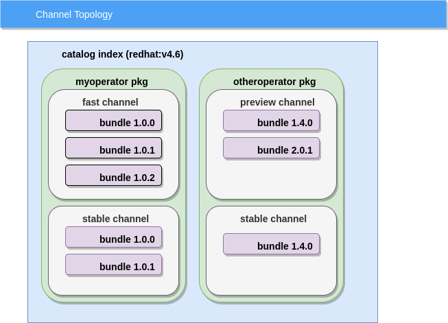
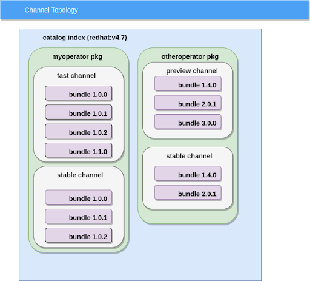

# Channel Naming

This guide shows OLM users how to use and choose naming conventions for channels to manage their operator upgrades. 

## CHANNELS

Operator Lifecycle Manager (OLM) provides a channel concept that allows you 
as the operator author a means to specify a set of update streams for your 
operator.

Operator authors deal with two key tasks associated with OLM channels, first, 
how to define a channel for your operator and then lastly how to interact 
with OLM to deploy your operator using channels.   

For each version of an operator you can specify a channel that it will belong 
to. Since there can be multiple versions of an operator within a channel, 
there is a notion of the latest version within a channel, or the channel head 
version.  It's the channel head that OLM will install for most subscriptions.  

There can also be multiple channels for a given operator package which is 
used to offer different support models (e.g. pre-release, production).  Here 
is a diagram that shows the relationship of operator versions to channels:



In the diagram above you can see the following:
  
  - A catalog index named “redhat:v4.6”, this catalog is built by a cluster administrator typically
  - There are 2 operator packages found in the catalog, myoperator and otheroperator.
  - The myoperator has 3 bundles (1.0.0, 1.0.1, 1.0.2).  Versions 1.0.0 and 1.0.1 are in multiple channels (fast, stable).  Whereas version 1.0.2 is only in the fast channel.
  - The otheroperator has 2 bundles specifying 2 different channels (preview, stable).  Version 1.4.0 specifies it is within 2 channels, stable and preview.


Here is the view of another catalog, “redhat:v4.7”, that shows you can change 
the upgrade path for an operator by what operator bundles are contained 
within the catalog:



### Defining Channels

Operator authors define the channels they intend to use by creating labels within their operator bundle.  Bundles  contain metadata about a particular operator version.  For example, when you build an operator bundle, you specify an annotations.yaml manifest which gets included into the bundle image.  Here is an example  snippet of an annotations.yaml file including channel information for that operator:

```
annotations:
  operators.operatorframework.io.bundle.channels.v1: preview
  operators.operatorframework.io.bundle.channel.default.v1: preview
  operators.operatorframework.io.bundle.manifests.v1: manifests/
  operators.operatorframework.io.bundle.mediatype.v1: registry+v1
  operators.operatorframework.io.bundle.metadata.v1: metadata/
  operators.operatorframework.io.bundle.package.v1: otheroperator
```

This example shows that you are defining the preview channel to be used for 
this operator bundle.  Operator bundles are loaded into an Operator Index 
image using the opm command.  It is important to note that by specifying a 
channel value like this, you are essentially creating a channel which can 
then be subscribed to.  If you mis-type the channel name, there is nothing 
that validates the channel value because the channel is known by whatever 
you provide.

Note that you can specify a default channel for a given operator package. This 
default channel is used when an operator is being installed to fulfill 
a dependency requirement of another operator.  The dependent operator will 
be installed from the dependent operator’s default channel as the first 
choice, falling back to other channels the dependent operator provides as 
necessary.  Default channels for an operator package are determined by the 
order in which operator bundles are added to the catalog, with the last 
bundle’s default channel value being used.  Note the default channel is 
also used if you create a Subscription that doesn’t specify a channel.

If your operator bundles do not specify a default channel, a default channel 
will be picked by OLM based on the lexical ordering of the channels you have 
specified.  For example, if your bundles specified channels of preview and 
stable, then preview would be picked based solely on the names chosen and 
character ordering (e.g. ‘p’ comes before ‘s’).  Dependency resolution is 
described in more detail here.

### Deploying Operators from Channels

When an end user or administrator wants to deploy an operator using OLM, 
they create a Subscription.  For example, here is a Subscription manifest:

```
apiVersion: operators.coreos.com/v1alpha1
kind: Subscription
metadata:
  name: sample-subscription
  namespace: my-operators
spec:
  channel: preview
  name: sampleoperator
  source: sample-operator
  sourceNamespace: my-operators
```

The Subscription is providing hints to OLM which are used to determine exactly which version of an operator will get deployed onto the cluster, in this example OLM will look for an operator to deploy that belongs to the preview channel within a specified catalog index source.  

Note that exactly which operator version is deployed can depend on more than what you specify in the Subscription.  On initial install, OLM will always attempt to install whatever is the head of the specified channel by default.  Settings within the operator’s CSV also are used by OLM to determine exactly which operator version OLM will deploy or upgrade.

## NAMING

Channel names are used to imply what form of upgrade you want to offer for your operator.  For example, you might have an operator that has a preview or alpha version which is not supported as well as a version where support is offered.

The names you choose are notional and up to you to decide, however, picking good channel names requires some basic guidance.  What is described below are different channel naming conventions that are commonly used by the operator community to denote different operator upgrade use cases.

### Naming Convention Rules

* Channel names are chosen by operator authors as they see fit to meet their upgrade strategies.
* Channel names are unique to your operator and do not collide with channel names used by other operator providers.
* Seldom is there a situation where your channel names need to contain information about the Kubernetes or Openshift cluster version they run on.  Only in the case where your operator versions have a dependency on the Kubernetes/Openshift version would you include the cluster version in your channel name.
* You typically would not include product names in your channels since the channels are unique to your product and will not collide with other channel names used by other operators.
* You could include or have an operand version in your channel name to advertise to consumers the version of operand they can subscribe to.


### Recommended Channel Naming

#### Example 1

| Channel Name       | Purpose |
| :------------- | :----------- |
| preview | Pre-release operators that would typically not have support offered and might be considered experimental. |
| fast | Released, supported operators which are still being monitored to assess stability/quality prior to promoting them as stable.  Generally used by early adopters or for testing in pre-production environments. | 
| stable   | Released, supported operators that have been observed to be stable through usage by consumers of the fast channel.\| |

With the above channel naming convention, you are always moving end users to 
the latest versions of your operator.  For example you could create a 
version 1.1.1 that is considered fast, adding it to the fast channel.  Users 
can experiment with that fast version, but the stable version for example 
1.2.0 would be added only to the stable channel.

#### Example 2

A possible but less typical case might be where an operator wants to be 
supported at various operator major/minor versions  For example you might 
have an operator version at 1.3 and also at 2.4 that you need or want to 
offer support for at the same time.  However, you might not want to have 
OLM upgrade users to the 2.4 operator but instead keep them upgrading within 
the 1.3 versions.   In that case, you would end up with channels as 
recommended above but with major/minor version information applied as follows:

| Channels for 1.3 | Channels for 2.4 |
| :------------- | :----------- |
| preview-1.3 | preview-2.4 |
| fast-1.3 | fast-2.4 |
| stable-1.3 | stable-2.4 \| |

#### Example 3

Another form of channel naming might have the operand version be specified 
instead of the operator version.  For example, consider a database operator 
that has operands of different database versions such as Version 12 or 
Version 13.  In this case, you might have the need to advertise your 
channels by the operand version as follows:

| Channels for Postgres 12       | Channels for Postgres 13 |
| :------------- | :----------- |
| preview-pg-12 | preview-pg-13 |
| fast-pg-12 | fast-pg-13 |
| stable-pg-12 | stable-pg-13 \| |

In this example, subscribers know which database version they are subscribing 
to and don’t necessarily care which operator version is being used, but will 
likely just want the latest operator version in that channel.  As with the 
previous naming convention examples, we start the channel name with 
preview/fast/stable to denote the maturity level of the operator.  Using all 
3 naming prefixes is optional, you might only want to support a stable channel.

# CHANNEL PROMOTION

Channel promotion is the notion of moving an operator from one channel to 
another.  For example, consider the case where you have an operator version 
1.0.1 which is found in a preview channel, then you might decide to offer 
support for that version and want to move it to a stable channel.  

Today, channel promotion is achieved by creating a new operator version 
(1.0.2) that is labeled with the channel(s) you want to promote to (as well 
as any channels you want to keep it in).
