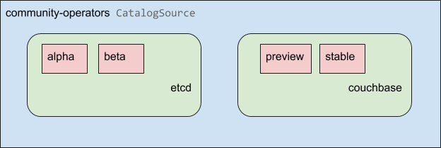
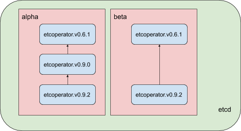
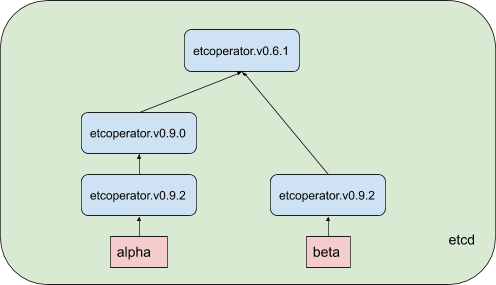
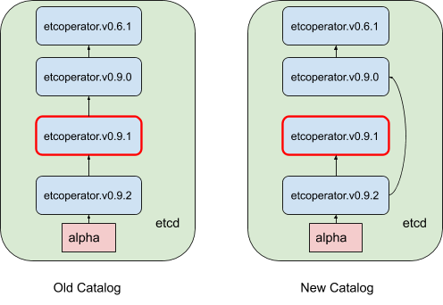
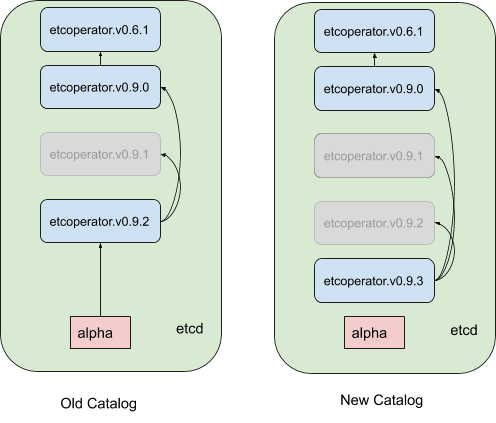

# How do operator upgrades work in Operator Lifecycle Manager (OLM)?


## Introduction
Resources Operator Lifecycle Manager uses to resolve upgrades:
1. ClusterServiceVersion (CSV)
2. CatalogSource
3. Subscription

## Sourcing Upgrades

In the OLM ecosystem, operator metadata (e.g. CSVs) can be stored in a collection called a `CatalogSource`. OLM uses CatalogSources, which use [Operator Registry API](https://github.com/operator-framework/operator-registry), to query for available operators as well as upgrades for installed operators.



Within a `CatalogSource`, operators are organized into packages and streams of updates called “channels” - which should be a familiar update pattern from OpenShift or other “evergreen” software like Google Chrome.



## Subscribing to Upgrades

A user indicates a particular package (etcd) and channel (alpha) in a particular `CatalogSource` in a `Subscription`. If a `Subscription` is made to a package that hasn’t yet been installed in the namespace, the newest operator in the catalog/package/channel is installed.

## Replaces / Channels

An operator’s definition, also known as `ClusterServiceVersion` (CSV), has a `replaces` field that indicates which operator it replaces. This builds a DAG ([directed acyclic graph](https://en.wikipedia.org/wiki/Directed_acyclic_graph)) of CSVs that can be queried by OLM, and updates can be shared between channels. Channels can be thought of as entrypoints into the DAG of updates. A more accurate diagram would be:

Channels example:
```yaml
packageName: example
channels:
- name: alpha
  currentCSV: example.v0.1.2
- name: beta
  currentCSV: example.v0.1.3
defaultChannel: alpha
```



## Upgrade Path

Given the upgrade scenario, there is an installed operator corresponding to CSV version `0.1.1`. OLM queries `CatalogSource` and detects an upgrade in the subscribed channel with new CSV version `0.1.3` that is replacing an older but not-installed CSV version `0.1.2` which in turn replaces older but installed CSV version `0.1.1`. OLM will walk back from channel head to previous versions via `replaces` field specified in CSVs to determine the upgrade path: `0.1.3` -> `0.1.2` -> `0.1.1` (the direction of arrow indicates the former is replacing the latter). OLM will upgrade operator one version at the time until it reaches the channel head. For this given scenario, OLM will install operator version `0.1.2` to replace existing operator version `0.1.1`. Then, install operator version `0.1.3` to replace previously-installed operator version `0.1.2`. At this point, the installed operator version `0.1.3` matches the channel head and the upgrade is completed.

## Catalog Invariant

For OLM to successfully query for updates, the following invariant must hold:

* Given a (`CatalogSource`, `Package`, `Channel`, `ClusterServiceVersion`) a catalog should be able to return, unambiguously and deterministically, a single CSV that `replaces` the input CSV.

# Skipping updates

OLM’s happy path for updates is:

* A `CatalogSource` is updated with one or more updates to an operator
* We traverse every version of the operator until we’re at the newest version the `CatalogSource` contains.

But sometimes this is not a safe operation to perform. There will be cases where a published version of an operator should never be installed on a cluster if it hasn’t already (e.g. because that version introduces a serious vulnerability).

In those cases we have to consider two cluster states and provide an update graph that supports both:

* The “bad” intermediate operator has been seen by a cluster and installed
* The “bad” intermediate operator has not yet been installed onto a cluster

By shipping a new catalog and adding a “skipped” release, we can keep our catalog invariant (always get a single unique update) regardless of the cluster state and whether it has seen the bad update yet.

For example:

```yaml
apiVersion: operators.coreos.com/v1alpha1
kind: ClusterServiceVersion
metadata:
  name: etcdoperator.v0.9.2
  namespace: placeholder
  annotations:
spec:
    displayName: etcd
    description: Etcd Operator
    replaces: etcdoperator.v0.9.0
    skips:
    - etcdoperator.v0.9.1
```



This has the properties that we want:

* Any operator found in Old has a single replacement in New
* Any operator found in New has a single replacement in New
* If the bad update has not yet been installed, it will never be

# Replacing Multiple Operators

Creating the “New Catalog” described above requires publishing CSVs that `replace` one operator, but can `skip` several.

## skipRange

```
olm.skipRange: <semver range>
```
where <semver range> has the version range format supported by the [semver library](https://github.com/blang/semver#ranges).

When searching catalogs for updates, if the head of a channel has `skipRange` annotation and the currently installed operator has a `version` field that falls in the range, we will update to the latest entry in the channel.

The order of precedence is:

1. Channel head in the source specified by `sourceName` on the subscription, if the other criteria for skipping are met
2. The next operator that replaces the current one, in the source specified by `sourceName`
3. Channel head in another source that is visible to the subscription, if the other criteria for skipping are met
4. The next operator that replaces the current one in any source visible to the subscription

`skipRange` example:

```yaml
apiVersion: operators.coreos.com/v1alpha1
kind: ClusterServiceVersion
metadata:
    name: elasticsearch-operator.v4.1.2
    namespace: placeholder
    annotations:
        olm.skipRange: '>=4.1.0 <4.1.2'
```

## Z-stream support

A z-stream (patch release) needs to replace all previous z-stream releases for the same minor version. OLM doesn’t care about major/minor/patch versions, we just need to build the correct graph in a catalog.

In other words, we need to be able to take a graph as in “Old Catalog” and, similar to before, generate a graph as in “New Catalog”



These are the properties that we want:

* Any operator found in Old has a single replacement in New
* Any operator found in New has a single replacement in New
* Any z-stream release in Old will update to the latest z-stream release in New
* Greyed-out releases can be considered “virtual” graph nodes (their content doesn’t need to exist, the registry just needs to respond as if the graph looks like this)
